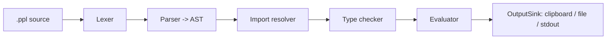

# Prompiler Language Specification

> **Status:** Draft and **fluid** — the language may change as we experiment with
> implementations. Items marked `OPEN` are unresolved but are **not blocking**;
> they may be settled during implementation rather than beforehand.

## 1. Overview

Prompiler is a dedicated, strongly-typed markup language for authoring prompts. A
Prompiler program declares reusable types (`enum`, `class`, `interface`) with
methods, and free functions, then defines `template` blocks that render a final
prompt string from typed inputs.

Prompiler is a **compiler**:



The compiler is a reusable core consumed by a TUI/CLI, an LSP server, and future
view layers (web, GUI) through ports and adapters.

### 1.1 Design principles

- **Pure.** No I/O, environment access, global state, or side effects in the
  language. Functions compute only from their arguments.
- **Strongly typed.** Every value and expression has a known type at compile time;
  type errors are reported before any evaluation.
- **Deterministic.** Evaluation is a total tree-walking interpreter over a
  type-checked AST. No recursion, so evaluation always terminates.
- **Safe.** There is no mechanism to execute arbitrary code or touch the world.
- **LL(1)-friendly.** The declaration and block grammar is recursive-descent
  parseable with one token of lookahead. Expression parsing uses precedence
  climbing.

## 2. Program structure

A program is a set of **files** with the `.ppl` extension (`OPEN`: final extension
and language name). A file contains top-level declarations in any order:

```
file := { declaration }

declaration := import
             | enum
             | class
             | interface
             | function
             | template
```

### 2.1 Project root and imports

- A `promptpiler.toml` file marks a repository root. The root is the **first**
  `promptpiler.toml` found by walking up from the current working directory.
- Imports are **whole-file** and use **relative paths** resolved against the
  importing file:

```
import "../types/review.ppl"
```

- Importing a file makes its top-level `enum`, `class`, `interface`, `function`,
  and `template` declarations available in the importing file.
- Name resolution is **lexical**: a name resolves in the innermost scope first,
  then outward through enclosing scopes to the global scope.
- **Shadowing is allowed**: an inner declaration may shadow an outer or imported
  name. Duplicate declarations in the *same* scope remain an error.
- Template composition forms a **DAG** (§16.2); a cyclic template reference is
  an error.

## 3. Lexical grammar

### 3.1 Comments

- Line comments: `// ...`
- Block comments: `/* ... */`

### 3.2 Identifiers and keywords

Identifiers match `[A-Za-z_][A-Za-z0-9_]*`.

Keywords (reserved):

```
import enum class interface func template variables prompt include
var if else for in return this true false none
string int float bool map array Optional
```

### 3.3 Literals

| Kind | Example |
|---|---|
| Integer | `42` |
| Float | `3.14`, `1.0` |
| String | `"hello"`, `'hello'` (UTF-8) |
| Boolean | `true`, `false` |

There is **no `null` literal**.

String literals use **C-style escapes**: `\n`, `\t`, `\r`, `\\`, `\"`, `\'`.
There are no multi-line string literals; use `\n`.

### 3.4 Composite and optional literals

| Kind | Syntax |
|---|---|
| Array | `[1, 2, 3]` |
| Map | `{ 'a': 1, 'b': 2 }` |
| Class | `Point { x: 1, y: 2 }` |
| Optional | `some(x)`, `none` |

A class literal always carries its type name before the braces, so it cannot be
confused with a map literal (which has a bare `{`).

## 4. Type system

### 4.1 Primitive types

```
string   int   float   bool
```

Scalar primitives (`int`, `float`, `bool`) carry **no methods**.

### 4.2 Array

```
T[]          // e.g. string[], ReviewConfig[]
```

Arrays are the **only iterable** type.

### 4.3 Map

```
map<string, T>   // string keys only
```

Maps are **not directly iterable**. They must be converted to an array first:

```
m.keys()     // array<string>
m.values()   // array<T>
```

`entries()` is deferred.

### 4.4 Enum

```
enum Difficulty {
  Easy,
  Medium,
  Hard,
}
```

Members are identifiers. Enum members are referenced as `Difficulty.Easy` and are
their own type.

### 4.5 Class

A class is a named set of typed fields and methods:

```
class ReviewConfig {
  strictness: Difficulty
  files: string[]
  max_issues: int

  func is_strict(): bool {
    return this.strictness == Difficulty.Hard
  }
}
```

Fields are immutable. Methods are declared with `func` inside the class body and
may read fields (and call sibling methods) through the implicit receiver `this`.
`this` is read-only and valid only within a method body. Method bodies follow the
same rules as functions (§7).

### 4.6 Interface

An interface declares a set of **required attributes (fields) and method
signatures**:

```
interface Named {
  name: string
  func label(): string
}
```

A method signature has the same form as a method but no body (§7).

Interfaces use **structural typing** (TypeScript-style). A class satisfies an
interface if and only if it provides **at least** the interface's fields with
compatible types **and** all of its method signatures; it may provide additional
fields or methods. There is no explicit `implements` clause.

A class method satisfies an interface method signature when the **name, arity,
and positional parameter types** match; **parameter names are not significant**
(calls are positional). The **return type is covariant**: the class method may
return any type assignable to the signature's return type — for example, a method
declared to return a concrete class satisfies a signature that returns an
interface that class satisfies.

Interfaces can be used anywhere a type is expected. They are the sanctioned
mechanism for expressing choice/alternatives: model the alternatives as classes
that satisfy a shared interface, and type the variable as the interface.

Interface inheritance (`extends`) is deferred.

### 4.7 Builtin classes

Builtins are first-class named types with a **method surface** for collections and
strings:

| Type | Methods |
|---|---|
| `string` | `length`, `upper()`, `lower()`, `trim()`, `replace(old, new)` |
| `T[]` (array) | `length` |
| `map<string, T>` | `keys()`, `values()`, `length` |

`length` is a property; the rest are methods. `OPEN`: exact method list is
provisional. This built-in method surface is **fixed**: built-in types cannot be
extended with new methods or have their methods overridden, unlike user-defined
classes, which declare their own methods (§4.5).

`Optional<T>` is a builtin type constructor that boxes an absent-or-present value:

| Type | Constructors / methods |
|---|---|
| `Optional<T>` | `some(x)`, `none`, `is_empty()`, `value()` |

- `some(x)` produces `Optional<T>` where `T` is the type of `x` (a builtin
  function call — no grammar change).
- `none` is an empty `Optional`; its element type is inferred from context (a bare
  `none` with no target type is a type error).
- `is_empty(): bool` tests emptiness; `value()` unwraps and is a runtime error
  (§16.1) if empty.

This fits the existing grammar: `Optional<T>` parallels `map`/`array`; `some` is a
builtin function and `none` is a literal; `is_empty()`/`value()` are method calls.

### 4.8 What is deliberately absent

- **No `null`** and no `T?` nullable marker. `Optional<T>` (§4.7) expresses
  absence; it is not `null`.
- **No union types** (`A | B`). Alternatives are modeled with interfaces + classes.
- **No user generics** — `array<T>`, `map<string,T>`, and `Optional<T>` are the only
  type constructors.
- **No `any` / `unknown` / `never`.**
- **No integer width distinctions** — `int` is signed 64-bit; `float` is IEEE-754
  64-bit.

## 5. Declarations

### 5.1 `enum`

```
enum Name { Member1, Member2, ... }
```

Members must be unique.

### 5.2 `class`

```
class Name {
  field: Type
  field: Type
  ...
  func method(param: Type, ...): ReturnType {
    statement
    ...
  }
}
```

Methods use the `func` keyword inside the class body and share the function-body
rules of §7; `this` denotes the receiver.

### 5.3 `interface`

```
interface Name {
  field: Type
  field: Type
  ...
  func method(param: Type, ...): ReturnType
}
```

Interface fields are required attributes; method signatures (no body) are
required methods.

### 5.4 `func` (function)

```
func name(param: Type, ...): ReturnType {
  statement
  ...
}
```

See §7. The `func` keyword appears in two contexts: a **top-level free function**
(as above), and a **method** declared inside a `class` body (§5.2) or as a
signature inside an `interface` (§5.3). Both share the same parameter, return
type, and body rules.

### 5.5 `template`

```
template Name {
  description: "..."          // optional; used for TUI/LSP display
  variables {
    name: Type [= literal]    // optional default
    ...
  }
  prompt {
    ... template text ...
  }
}
```

## 6. Variables and the input model

### 6.1 Deriving inputs

All variables are **derived from the template** and queried from the user at run
time. Complex-typed variables (classes, arrays, maps) are collected by drilling
into the type and prompting for its fields recursively (§14.1). Values never come
from environment variables, files, or global state.

### 6.2 Required vs. optional

- A variable with a `default` is **optional**: the user may skip it and the default
  applies.
- A variable without a `default` is **required**: the user must supply a value.
- Defaults are **literals only**. A primitive variable may have a literal default
  of its type (e.g. `max_issues: int = 5`). For an enum-typed variable, the
  default must be one of its members.

Variables are **immutable**.

## 7. Functions

Functions are **pure, first-order, and non-recursive**. All functions are **global**
and share a single function namespace across the program.

- No I/O, environment access, global state, or side effects.
- No recursion (direct or indirect) — the call graph must be acyclic.
- No higher-order functions (functions are called, not passed or returned).
- Explicit, required return type.
- No overloading (one definition per name).
- Functions may call other functions, including forward references.

### 7.1 Function body

```
func double(x: int): int {
    var y = x * 2          // immutable local binding
    if (y > 10) {
        return y
    } else {
        return y - 1
    }
}
```

Statement set:

- `var name = expr` — immutable local binding.
- `if (expr) { ... } else { ... }`
- `for (x in expr) { ... }` — loop variable immutable.
- `return expr`

No reassignment, no `while`, no expression statements. `var` and loop variables
are block-scoped; **shadowing an outer name is allowed**.

### 7.2 Methods

Methods declared inside a `class` body (§5.2) follow the same rules as functions:

- Pure, no I/O or side effects; read-only over `this` and its fields.
- Non-recursive: the combined call graph of functions **and** methods must be
  acyclic. A method may call other methods or functions, including forward
  references, but not itself, directly or transitively.
- No overloading: one method per name per class, and a field and a method may not
  share a name.
- Explicit, required return type.

Within a method body, `this` is an implicit, immutable receiver whose type is the
enclosing class. Fields and sibling methods are reached through `this` (`this.x`,
`this.other()`); there is no implicit bare-name resolution. `this` is valid only
inside a method body.

## 8. Prompt body and templating

The `prompt` block contains literal text and template constructs. There are two
kinds of constructs, distinguished by their delimiter (LL(1)-friendly):

### 8.1 Interpolation

```
{{ expr }}
```

Evaluates `expr` and inserts its string form. Only **scalars and enums** are
stringable:

| Type | String form |
|---|---|
| `string` | verbatim |
| `int` | decimal |
| `float` | shortest round-trip decimal (`3.14`) |
| `bool` | `true` / `false` |
| enum member | its bare member name (`Easy`) |

Arrays, maps, and classes are **not** stringable; convert explicitly (`join`, a
`` loop, field access, `keys()`/`values()`).

### 8.2 Loops

```

  ... body ...

```

`expr` must evaluate to an array. `item` is an immutable loop variable scoped to
the body.

### 8.3 Conditionals

```

  ... body ...

  ... body ...

```

`expr` must evaluate to `bool`. The `else` branch is optional.

### 8.4 Whitespace rule

Indentation is **preserved exactly as written**. Literal text is emitted verbatim
(including its leading whitespace), and each construct is replaced in place by its
rendered output, which inherits the indentation of the expression itself — the
leading whitespace before the opening delimiter (`{{` or `{%`).

- `{{ expr }}` renders in place; its output starts at the expression's own column.
- Multi-line output is **anchored**: the first line sits at the expression's
  column, and each subsequent line keeps its internal relative indentation added
  to that column.
- `` / `` bodies preserve their own written indentation.

Example — a single-line value:

```
template Greet {
  variables { name: string }

  prompt {
    Hello {{ name }}!
    End
  }
}
```

If `name` renders `World`, the output is:

```
    Hello World!
    End
```

Example — a multi-line value `code` whose text is:

```
def foo():
    return 1
```

Template:

```
template Code {
  variables { code: string }

  prompt {
    {{ code }}
  }
}
```

The `{{ code }}` sits at column 4. Anchored output:

```
    def foo():
        return 1
```

The first line gets the expression's 4-space indent; the second line keeps its
internal 4-space indent **plus** the base, yielding 8 spaces.

### 8.5 Escaping

Prompt text uses C-style backslash escapes. The escape `\{` renders a literal `{`,
`\}` renders a literal `}`, and `\\` renders a literal `\`. Thus a literal `{{` is
written `\{\{` and a literal `{%` is written `\{%`.

This disambiguates a literal `}` (written `\}`) from the `}` that closes the
`prompt` block.

### 8.6 Template include

```
{{ include TemplateName(named: arg, ...) }}
```

Invokes another template inline, passing named arguments that bind its variables.
The rendered output is spliced in place (see §16.2). `include` is a keyword.

## 9. Expressions

### 9.1 Grammar (precedence, low to high)

| Level | Operators | Associativity |
|---|---|---|
| 1 | `\|\|` | left |
| 2 | `&&` | left |
| 3 | `==` `!=` | left |
| 4 | `<` `<=` `>` `>=` | left |
| 5 | `+` `-` | left |
| 6 | `*` `/` `%` | left |
| 7 | unary `!` `-` | prefix |
| 8 | postfix call / index / access / method | left |

Primary expressions:

- literals (`int`, `float`, `string`, `bool`)
- identifiers
- enum member access: `Difficulty.Easy`
- field access: `expr.field`
- index: `expr[expr]`
- call: `name(args)` — user-defined and standard-library functions
- cast: `int(x)` / `float(x)` / `string(x)` / `bool(x)` — builtin type names in
  call position
- method call: `expr.method(args)` — builtin classes, user-defined class methods,
  and interface signatures
- parenthesized: `(expr)`

Operator semantics:

- `/` always yields `float` (`int / int` is `float`); operands must be the same
  type (no implicit coercion).
- `%` is integer-only and follows Go's truncated semantics (sign of the dividend).
- `+` on `string` is concatenation (implemented as a string builder); `+` on
  numbers is arithmetic.
- `==` / `!=` work on scalars, enums, and structural equality for classes, arrays,
  and maps; `<` `<=` `>` `>=` are numeric only.
- `&&` / `||` short-circuit left-to-right.
- Integer arithmetic is signed 64-bit; overflow is a runtime error (§16.1).

### 9.2 Expression forms

```
name.upper()                 // method call
files.length                 // property access
map.keys()                   // method returning array<string>
join(a, ",")                 // function call (standard library)
Difficulty.Hard == d         // enum comparison
count > 3 && strict          // boolean logic
```

## 10. Standard library

The standard library ships with the binary and is **auto-available** in every file
(no explicit import). It is installed alongside the tool via `go install` or an
equivalent distribution. Utilities are **free functions** (not special syntax, not
methods).

| Function | Signature | Returns |
|---|---|---|
| `range` | `range(n: int)` | `int[]` from `0` to `n-1` |
| `join` | `join(a: string[], sep: string)` | `string` |
| `int` | `int(x)` | `int` (explicit cast) |
| `float` | `float(x)` | `float` (explicit cast) |
| `string` | `string(x)` | `string` (explicit cast) |
| `bool` | `bool(x)` | `bool` (explicit cast) |

Casts use a builtin type name in call position (`int(x)`, `float(x)`, `string(x)`,
`bool(x)`); they are not special syntax. Cast details:

- `int(x)` from `float` truncates toward zero; from `string` parses a decimal
  integer.
- `float(x)` parses an integer or decimal string.
- `string(x)` accepts scalars and enums (their string form).
- `bool(x)` accepts `string` `"true"`/`"false"` and `int` `1`/`0`.

A failed cast is a runtime error (§16.1).

### 10.1 Loop index

Loop index is **not** special syntax. Instead, `range` produces an array of
indices, which you iterate and then use to index the target array:

```

  - {{ i }}: {{ files[i] }}

```

This reuses two primitives already in the language — `array.length` and array
indexing — so it introduces no new type or loop form.

## 11. Type checking rules

Type checking happens entirely at compile time (`promptpiler check` / LSP
diagnostics). The checker produces **positioned diagnostics** for:

- unknown type references
- missing or cyclic imports
- duplicate top-level names
- duplicate enum members
- invalid field/variable types
- default value not assignable to the declared type
- enum default not a member of the enum
- type mismatch in expressions (arithmetic, comparison, assignment)
- calling a non-function, wrong arity, or wrong argument type
- calling a method that does not exist on the receiver's type
- duplicate member names within a class (a field and a method, or two methods,
  with the same name)
- `this` used outside a method body
- iterating over a non-array (maps must be converted via `keys()`/`values()`)
- interface satisfaction failures at assignment sites (a missing or mistyped
  field or method, or a non-covariant method return)

### 11.1 Assignability

A value of type `S` is assignable to a target of type `T` when:

- `S == T`, or
- `T` is an `interface` and `S` is a `class` that structurally satisfies `T`.

There is **no implicit coercion** between `int` and `float` (or any other types).
Type changes require an explicit cast (`int(x)` / `float(x)` / `string(x)` /
`bool(x)`, §10).

### 11.2 Covariance and recursion

- **Array covariance**: `B[]` is assignable to `A[]` when `B` is assignable to `A`
  (arrays are immutable, so this is sound).
- **Recursive types**: a class may reference itself only through a collection or an
  `Optional<T>` (e.g. `class Node { next: Optional<Node> }`). A directly recursive
  non-collection, non-`Optional` field is a compile error. This restriction applies
  to field storage only; method signatures may reference the enclosing class type
  freely.

## 12. Compiler pipeline

1. **Lexer** — produces a token stream with source positions (byte offset, line,
   column).
2. **Parser** — recursive descent, **error-recovering**, produces an AST (with
   error markers) and collects **all** syntax errors.
3. **Resolver** — loads imports, builds a symbol table, detects missing/cyclic
   imports and duplicate/undefined names.
4. **Type checker** — performs full static analysis (§11).
5. **Evaluator** — tree-walking interpreter over the type-checked AST, rendering
   the prompt string from collected inputs.

The core compiles from **in-memory text** (not only disk), which is required for
LSP unsaved buffers.

### 12.1 Parser error recovery

The parser never aborts on the first error. It synchronizes at declaration and
statement boundaries (and `}`), records each error with its span, and continues so
that the LSP can report **all** errors in a file at once.

## 13. LSP (v1)

The compiler core is reused by the LSP server. v1 features:

- **Diagnostics** — syntax errors + type errors, with spans.
- **Hover** — type information for variables, fields, methods, and functions.
- **Completion** — variables, fields, enum members, methods, and functions in scope.
- **Go-to-definition** — types, functions, methods, variables, and fields.

Deferred: rename, find-references, workspace symbol search.

## 14. CLI / TUI

Commands:

```
promptpiler list                   # enumerate templates
promptpiler check                  # type-check all templates; exit non-zero on error
promptpiler run <template>         # TUI: collect inputs -> render -> emit
promptpiler lsp                    # run the language server
```

### 14.1 Input collection (TUI)

The TUI collects values for each template variable. A variable is shown as
`<variable_name>: <type>`. Selecting it drills into the type and prompts for its
required values:

- **Scalar / enum**: a text input, or a select list for enums.
- **Class / interface**: drill into the type and prompt for each required field.
  For an interface, the user first chooses which satisfying class to provide.
- **Array**: prompt for elements, each of which may itself be a complex type.
- **Map**: prompt for key/value pairs.
- **Nested types**: drilling recurses to any depth.

The TUI is only for **value collection and evaluation at runtime**; type and
template definitions are authored in source code via other means.

### 14.2 Ports and adapters

The domain core depends only on ports it owns:

- `ValueSource` — collects typed input values (TUI is the v1 adapter).
- `OutputSink` — writes the rendered prompt (stdout / file / clipboard adapters).
- `TemplateStore` — loads templates and types (filesystem adapter).

The TUI is one adapter over these ports; a web/GUI adapter can replace it without
touching the core.

## 15. Go package layout

Module: `github.com/Jh123x/promptpiler`.

```
cmd/promptpiler           # CLI/TUI entrypoint
cmd/promptpiler-lsp       # LSP server entrypoint (or `promptpiler lsp`)
internal/token            # token type + source spans
internal/lexer            # lexer
internal/ast              # AST node definitions
internal/parser           # recoverable recursive-descent parser
internal/resolver         # imports + symbol table
internal/types            # type system + type checker
internal/builtin          # builtin classes + standard library
internal/eval             # evaluator / interpreter
internal/domain           # orchestration + ports (ValueSource/OutputSink/TemplateStore)
internal/adapters/tui     # TUI adapter
internal/adapters/output  # stdout / file / clipboard
internal/adapters/lsp     # LSP adapter
```

## 16. Semantics

### 16.1 Runtime errors

Evaluation can fail at runtime even though the program type-checks:

- array index out of bounds
- division or modulo by zero
- integer overflow (signed 64-bit; arbitrary precision is a future extension)
- `range(n)` with a negative `n`
- a failed cast (e.g. `int("abc")`)
- unwrapping an empty `Optional`

Each is reported with a source span, a message, and a stack trace so the user can
see which input variable (or expression) to correct. When the offending operand is
a compile-time constant, the error is reported at compile time instead.

### 16.2 Template composition (DAG)

A template may invoke another template inline within its `prompt` body:

```
{{ include Parent(lang: "go", config: myConfig) }}
```

The parent's `variables` act as parameters; the child supplies a **named
argument** for each, and the argument types are **checked at compile time**
(surfaced by `check` and the LSP). The parent's rendered output is **spliced in
place**, following the same whitespace rules as `{{ expr }}` (§8.4).

When a template is invoked via `include`, its variables are bound to the supplied
arguments and are **not** prompted. A template invoked directly
(`promptpiler run`) prompts for its variables instead.

Template references form a **directed acyclic graph**: a template may not include
itself, directly or transitively (a cyclic reference is a compile error).

## 17. Open items

1. **Language name + file extension** (provisional: `.ppl`).
2. **Standard library function list** — grows over time (§10).
